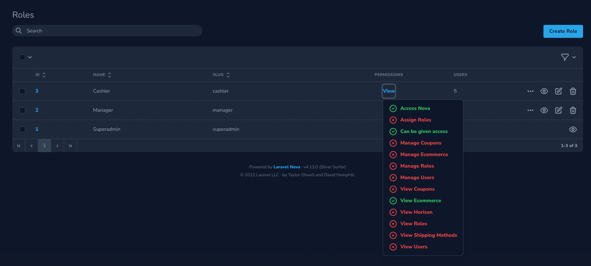
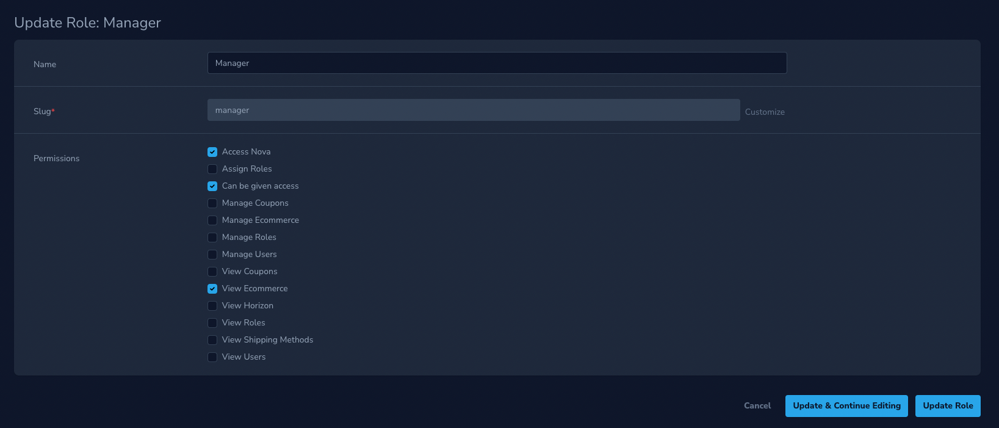

# Laravel Nova Permissions (Roles and Permission based Access Control (ACL))

Add Access Control by means of User based Roles and Permissions to your Nova installation. Includes default User and Role Policies which can be managed through your Nova Admin Panel.

This tool uses the [Silvanite\Brandenburg](https://github.com/Silvanite/brandenburg) package under the hood to manage user roles. Brandenburg is used because it has clear separation of concerns

This package is a fork of the unmaintained Nova 3 version of [Silvanite/novatoolpermissions](https://github.com/Silvanite/novatoolpermissions).

## Screenshots





## Premise

> _Roles_ are defined in the _Database_

> _Permissions_ are defined in the _Codebase_

As a result, you won't see any _Permissions_ resource. The _Roles_ resource will get the permissions from the Gates defined in your code.

## Installation

Install the tool using composer

```sh
composer require outl1ne/nova-permissions
```

Run the migrations to add the database tables required by Brandenburg.

```sh
php artisan migrate
```

Add the `HasRoles` trait to your User model as per the [Brandenburg installation instructions](https://github.com/Silvanite/Brandenburg).

```php
// app/User.php

use Silvanite\Brandenburg\Traits\HasRoles;

class User extends Authenticatable
{
    use HasRoles;
    ...
}
```

Load it into your Nova Tools to display the Roles within your Resources

```php
// app/Providers/NovaServiceProvider.php

use Outl1ne\NovaPermissions\NovaPermissions;

public function tools()
    {
        return [
            new NovaPermissions(),
        ];
    }
```

You can assign Users to Roles from the Role resource, however if you want to assign Roles from your User resource you will need to add an additional relationship.

```php
// app/Nova/User.php

use Outl1ne\NovaPermissions\Nova\Resources\Role;

public function fields(Request $request)
{
    return [
        ...
        BelongsToMany::make('Roles', 'roles', Role::class),
    ];
}
```

If you are not using the defaul `App\Nova\User` Resource you can customise this by publishing the `nova-permissions` config and setting your User resource model.

```sh
php artisan vendor:publish --provider="Outl1ne\NovaPermissions\Providers\PackageServiceProvider"
```

Remove the default `viewNova` Gate to use the Gate included by this package. You will need to keep the gate() method in place, just empty it.
Note: Nova will always allow access in development environments.

```php
// app/Providers/NovaServiceProvider.php

protected function gate()
{
    //
}
```

## Usage

Once installed, go ahead and create your first Role. E.g. `Administrator` and assign all permissions to your new Role.

Finally assign the Administrator Role to your user account.

**Note:** By default, the package allows anyone access to a permission if no single user has access to it. This is to prevent you from locking yourself out of features. As such, it is important to define your primary admin role which has access to all permissions, meaning nobody else has access unless you specifically grant it.

## Default Permissions

This package comes with a set of default permissions to provide full access control to the package's functionality. Permissions come with default english translations to provide a better user experience. You are free to replace these with translations in your applications json translations.

```json
{
    "viewNova": "Access Nova",
    "viewRoles": "View Roles",
    "manageRoles": "Manage Roles",
    "assignRoles": "Assign Roles",
    "viewUsers": "View Users",
    "manageUsers": "Manage Users"
}
```

## Custom permissions

To create your own permissions, simply define them in your service provider and create a _Policy_ for your resource/model. Let's work with a common _Blog_ example and assume that you have a **Blog** Model and Resource in your application.

Create a _Policy_ for your Nova Resource

Create a new policy for your blog

```sh
php artisan make:policy BlogPolicy
```

Let's assign the Policy and define our Gates.

```php
// app/Providers/AuthServiceProvider.php

use Silvanite\Brandenburg\Traits\ValidatesPermissions;

class AuthServiceProvider extends ServiceProvider
{
    use ValidatesPermissions;

    protected $policies = [
        \App\Blog::class => \App\Policies\BlogPolicy::class,
    ];

    public function boot()
    {
        collect([
            'viewBlog',
            'manageBlog',
        ])->each(function ($permission) {
            Gate::define($permission, function ($user) use ($permission) {
                if ($this->nobodyHasAccess($permission)) {
                    return true;
                }

                return $user->hasRoleWithPermission($permission);
            });
        });

        $this->registerPolicies();
    }
}
```

Finally, specify the access control in your Policy as per the Nova documentation.

```php
// app/Policies/BlogPolicy.php

use Illuminate\Support\Facades\Gate;

public function viewAny($user)
{
    return Gate::any(['viewBlog', 'manageBlog'], $user);
}

public function view($user, $post)
{
    return Gate::any(['viewBlog', 'manageBlog'], $user, $post);
}

public function create($user)
{
    return $user->can('manageBlog');
}

public function update($user, $post)
{
    return $user->can('manageBlog', $post);
}

public function delete($user, $post)
{
    return $user->can('manageBlog', $post);
}

public function restore($user, $post)
{
    return $user->can('manageBlog', $post);
}

public function forceDelete($user, $post)
{
    return $user->can('manageBlog', $post);
}
```

And add your labels to your translations to keep everything tidy.

```json
{
    "viewBlog": "View Blog",
    "manageBlog": "Manage Blog"
}
```

This example is a super-simple implementation. You can define your Gates as in any standard Laravel Application and can simply add the additional checks to validate them against your assigned Roles and Permissions.

## Access Control

Sometimes you might want to prevent some users from accessing content, but not others. To achieve this, use the included `HasAccessControl.php` trait on your model.

To check if a user has the correct permissions to view your content, either load the `AccessControlServiceProvider` to register the `accessControl` gate globally. Or include the `AccessControlGate` trait on your models policy.

On your Nova resource, add the AccessControl field. This will display all roles with the `canBeGivenAccess` permission. To protect content from being accessed, at least one Role has to be given access to the model, otherwise the resource will be available to everyone.

```php
public function fields(Request $request)
{
    return [
        // ...
        AccessControl::make(),
        // ...
    ]
}
```

## Credits

-   [Marco Mark (@m2de)](https://github.com/m2de) - Original creator of Silvanite/novatoolpermissions
-   [Tarvo Reinpalu](https://github.com/tarpsvo)

## License

Nova Permissions is open-sourced software licensed under the [MIT license](LICENSE.md).
